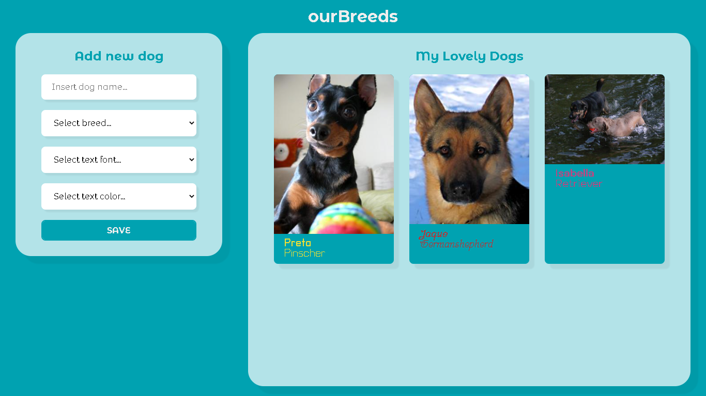

<div align="center">
<a href="https://geovanijose.github.io/challenge-enext/">
  
  </a>
</div>

# ourBreeds :dog:
 > Projeto web desenvolvido para o challenge da Enext

## Como rodar :white_check_mark:
> Para rodar você ter instalado na sua máquina o [Git](https://git-scm.com) e o [Yarn](https://yarnpkg.com/)
1. Clone este repositório
```bash
$ git clone https://github.com/GeovaniJose/challenge-enext.git
```

2. Entre na pasta do repositório
```bash
$ cd challenge-enext
```

3. Instale as dependências
```bash
$ yarn ou yarn install
```

4. Inicie a aplicação
```bash
$ yarn start
```

## Tecnologias :wrench:
> Tecnologias usadas no desenvolvimento do projeto:
- ReactJS
- Yarn
- Sass
- Axios
- GitHub Pages
- shortid